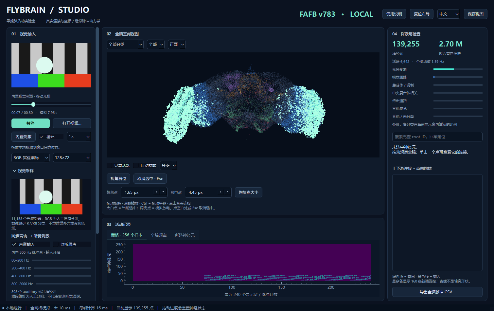

# FlyBrain Studio · 果蝇脑活动实验室

给一颗小小的果蝇脑放段视频，看看神经元会怎样亮起来。

FlyBrain Studio 是一个好玩的桌面实验工具：把视频和声音接入基于真实果蝇连接组的神经网络模拟，在 3D 大脑里观察活动、追踪连接，随手调整参数，看看会发生什么。无需先学会神经科学，也可以从拖入第一段视频开始。



## 可以玩什么

- **换一段视频。** 动画、音乐视频、自己拍的风景，都可以拖进窗口。
- **逛一逛大脑。** 旋转、缩放、点击神经元，查看它连接到了哪里。
- **试试不同输入。** 切换彩色和灰度，开关声音，调整输入强度，对比活动变化。
- **按自己的喜好观察。** 筛选神经元类别、只显示活跃点、调整放电点大小，或者让大脑自动旋转。
- **留下实验记录。** 保存截图，导出最近 3 个模拟秒的全脑脉冲事件和参数。

支持中文 / English。视频在本地处理，数据准备好后可以离线运行。

## 开始玩

如果使用 Windows 打包版，解压整个应用文件夹，双击 `FlyBrainStudio.exe`。请保留旁边的 `_internal` 文件夹。

打开后已经有内置的移动光栅演示。把本地视频拖进窗口，或者点击「打开视频」，就可以换成自己的内容。想听到视频原声，勾选「监听原声」；内置演示音只作为模型输入，不会从扬声器播放。

左侧面板可以拖动分隔线调整宽度，「视觉采样」可以收起。调乱了也没关系，界面提供布局、视角、点大小和输入参数的复位按钮。

| 操作 | 用法 |
| --- | --- |
| 旋转 / 缩放 | 左键拖动 / 滚轮 |
| 平移 | Ctrl + 拖动 |
| 查看神经元 | 点击一个点，或在右侧搜索 root ID |
| 取消选中 | Esc，或点击空白处 |
| 视角复位 | Home |
| 播放 / 暂停 | 空格 |
| 打开视频 | Ctrl + O |
| 清零神经状态 | R |

点击神经元后出现的白点是选中标记，直线是它的输入和输出连接。拖动视频进度会从新位置重新开始模拟。

## 这颗脑从哪里来

使用 **FlyWire 官方 FAFB v783** 发布数据：139,255 个神经元、约 270 万条聚合有向连接。下载脚本直接读取官方 CSV，保留真实神经元 ID 和标注坐标。

连接组提供结构，简化的 LIF 模型负责产生放电，视频和声音通过实验性编码输入网络。你看到的是这个模型的活动；它还不能代表活体果蝇的真实感受或对视频的理解。

对背后的实现感兴趣，可以接着看[模型与数据说明](docs/MODEL.md)，里面有输入映射、模拟参数和数据处理过程。

## 从源码运行

当前测试环境为 Windows 11、Python 3.14。首次运行需要联网安装依赖并下载官方数据。

在项目目录打开终端：

```powershell
python -m venv .venv
.venv\Scripts\python -m pip install -r requirements.txt
.venv\Scripts\python scripts/download_data.py
.venv\Scripts\python scripts/prepare_data.py data/raw/783 data
.venv\Scripts\python main.py
```

原始下载和生成的数据文件不放进 Git 仓库，下载来源与校验值记录在 [data/manifest.json](data/manifest.json)。

运行测试：

```powershell
.venv\Scripts\python -m unittest discover -s tests -p "test_*.py"
.venv\Scripts\python tests/desktop_smoke.py test-output
```

打包 Windows 应用：

```powershell
.venv\Scripts\python -m pip install pyinstaller==6.22.3
.\scripts\build.ps1 -Python .\.venv\Scripts\python.exe
```

生成的程序位于 `release-official/FlyBrainStudio/`。测试记录见 [VALIDATION.md](VALIDATION.md)。

## 一起折腾

这个项目由我借助 AI 辅助开发，从“想看看果蝇脑能不能看视频”开始，一点点做成了现在的样子。

欢迎提 Issue、发 PR，或者分享你试过的有趣输入。新的观察方式、更好的交互和更贴近生物学的模型，都很欢迎。

## 致谢与许可

感谢 [FlyWire](https://codex.flywire.ai/) 研究团队公开连接组数据，让这样的探索成为可能。

原始研究：Dorkenwald et al., *Neuronal wiring diagram of an adult brain*, Nature (2024). [论文](https://doi.org/10.1038/s41586-024-07558-y)

应用代码采用 [MIT](LICENSE) 许可证；FlyWire 科学数据遵循其独立的 **CC BY-NC 4.0** 条款。数据及依赖库的声明见 [THIRD_PARTY.md](THIRD_PARTY.md)。

